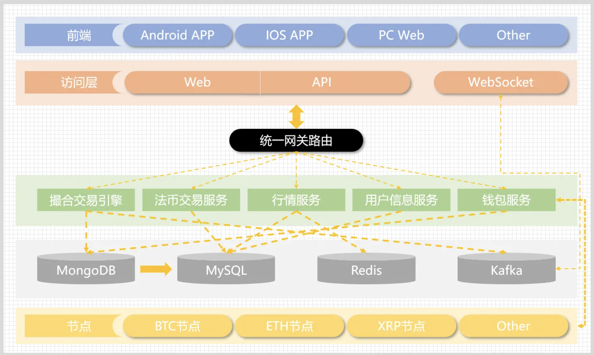
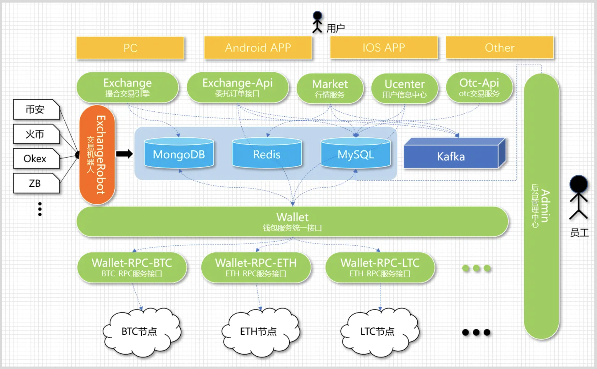
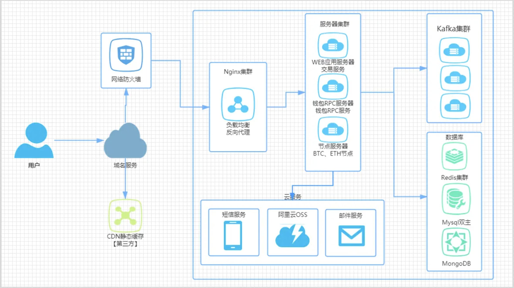
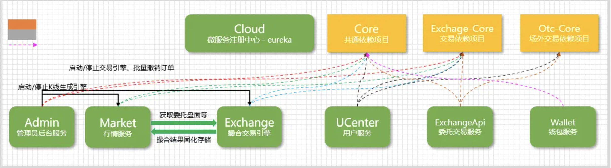

# Cex数字货币、永续合约交易系统

### 重要说明

1. 本项目是一个加密货币交易平台的演示项目，仅用于展示和学习目的。
2. 项目中的所有代码、文档和资源仅供学习参考，不得用于任何商业用途。
3. 本项目不提供任何投资建议，也不对任何投资决策负责。
4. 使用本项目时，请遵守当地法律法规。
5. 项目开发者不对使用本项目造成的任何损失负责。
6. 本项目不涉及真实资产交易，不推荐或倡导任何形式的金融活动

### 学习目的

- 了解加密货币交易平台的基本架构和相关业务
- 研究区块链和加密货币相关技术

## 项目介绍：

- Cex 旨在打造一家领先的数字资产交易所，为全球用户提供安全、高效、创新的金融服务。作为一家交易平台，我们注重用户隐私和资产安全，采用最先进的区块链技术，为用户提供更快、更便捷的交易体验。

- Cex 交易所将支持多种数字资产的交易，涵盖加密货币、代币化资产以及其他数字化资产。我们拥有币币兑换、永续合约、期权合约、秒合约以及创新理财等市场上前沿的功能，我们致力于为投资者提供多元化的投资选择，推动数字资产的创新与发展。
  在合规方面，我们将积极配合全球金融监管，建立健全的法规框架，确保平台的合规运营。我们追求公正透明的市场环境，维护投资者的权益，为市场参与者提供稳定可靠的交易平台。
  通过不断优化和创新，我们的愿景是成为全球领先的数字资产交易平台，为用户创造更多价值，推动金融科技的进步，促进数字经济的可持续发展。

## 警告：

##### 风险提示

1. 法定货币风险：
   数字资产不是法定货币，其价值可能受到极大波动。投资者应当理性看待数字资产价格的变动，并注意市场风险。

2. 监管合规：
   数字资产交易存在合规风险，不同平台可能面临监管政策的变化。投资者应选择合规的平台，了解并遵守相关法规，以保障自身权益。

3. 投资风险：
   数字资产市场具有高度波动性，投资者可能面临资产损失的风险。在参与交易前，请仔细评估自身风险承受能力，并做好风险管理。

4. 非法平台警示：
   提醒投资者远离未经授权或存在违法行为的数字资产平台，以防止遭受不法侵害。

5. 投资知识：
   数字资产交易需要具备一定的投资知识，投资者应当不断学习，提高自身风险识别和应对能力。

6. 个人信息保护：
   在选择数字资产交易平台时，注意平台对个人信息的保护措施，防范个人信息泄露风险。

7. 虚假宣传：
   注意防范虚假宣传和不实信息，避免受到虚假交易平台的误导。

8. 资金安全：
   保障资金安全是投资者的首要任务，选择有声誉、安全性高的数字资产交易平台进行交易。

##### 你需要知道的基本知识

- 法律知识（安全第一条，法律最重要）<br>
- Java 知识（主要是 spring）<br>
- linux 知识（CentOS、Ubuntu 等等）<br>
- 前端（Vue，Java）<br>
- 其他安全知识等等

##### 主要技术

- 后端：Spring、SpringMVC、SpringData、SpringCloud、SpringBoot<br>
- 数据库：Mysql、Mongodb<br>
- 其他：redis、rocketMq、阿里云 OSS、腾讯防水校验、环信推送<br>
- 前端：Vue<br>

## 整体架构

#### 

## 逻辑架构

#### 

## 部署架构

#### 

## 依赖关系

#### 

## 环境搭建

- Centos 7.6+
- MySQL 5.7.16+
- Redis 6.2.7
- Mongodb 4.0+
- rocketMq 4.4.0
- nginx-1.16.0+
- JRE 8u241
- JDK 1.8
- Vue

# 项目说明

项目分为前端（cex-front）、后端（cex-backend）、本地链（cex-chain）三个模块

前后台启动文档分别在对应文件下`README.md`中

## 钱包充值流程说明

钱包业务演示参考以下文档说明

### 启动模块

钱包需要启动**前台**、**后台**和**本地链**三个模块

**前后台启动**：（前后台的启动说明分别在对应文件夹下）

**链启动**：（使用hardhat启动一个本地链，用于模拟真实链上转账场景）

1. 进入链模块：`cd cex-chain`
2. 安装依赖：`yarn install` or `npm install`
3. 启动本地链：`npx hardhat node`
4. 部署USDT：`npm run deploy`

**项目重启**
若项目链重启，需要重新启动后台容器重置同步的区块，按照以下步骤执行

1. 停止当前链，进入本地链项目，重启链`npx hardhat node`
2. 删除掉docker当前容器，进入后台项目，删除`sql/data`下内容，重新执行`docker compose up -d`，启动容器

### 充值流程

0. **同步区块**：见视频课程，先保证后台扫描的区块高度和链上区块高度同步，如果链上高度落后于后台扫描高度，手动调用增加区块，保证链上和后台扫描区块高度同步

1. **账号转账**：使用默认账号0x....2266（或其他有原生代币的账号），向cex平台提供的充值地址转账（usdt充值需先往归集地址转账一部分eth作为平台转账操作的手续费）

2. **确认交易**：转账后，当监控模块检测到区块增加一定块数后，cex会在后台确认交易（在后台确认confirm deposit日志输出）
   此过程在测试环境上，需要手动挖矿，增加当前区块数，用于cex后台确认转账交易（目前确认数为1），在控制台调用命令手动挖矿（确认本地链已启动，并且地址为 localhost:8545）

**hardhat出块逻辑说明**：在当前有交易时，会自动出一个块，静止时不会出块，可以手动通知链强制出块，因为是测试链，这种方式出块不会扣任何账户挖矿费用

### 提币流程

1. **触发归集**：在交易所中，为了保证用户资金安全，会在用户充值一定金额后，选择在gas费较低的时期，将用户资金统一转入一个归集账户（一般是冷钱包），用户提币时，再由指定提币账户（withdrawWallet）转出到用户提币地址，本地演示时，在提币前需要手动执行触发一下归集操作

2. **提币**：提币需要支付一定手续费，交易所从withdrawWallet中，从用户提币数额中扣除手续费，转至用户指定账户

```shell
curl -X POST --data '{"jsonrpc":"2.0","method":"hardhat_mine","params":["0x1"],"id":1}' localhost:8545
```

**_查询数据库账号_**

以下{}中对应mongodb的容器id

docker exec -it {} mongo -u admin -p admin123 --authenticationDatabase admin

use wallet

db.ETH_address_book.find();

docker日志中出现以下日志时，表示转账成功

```
2025-08-19 06:55:23 06:55:23 [Thread-7] INFO  c.bizzan.bc.wallet.component.Watcher - 当前网络区块高度,23160831
2025-08-19 06:55:23 06:55:23 [Thread-7] INFO  c.bizzan.bc.wallet.component.Watcher - replay block from 23160827 to 23160827
2025-08-19 06:55:23 06:55:23 [Thread-7] INFO  c.b.bc.wallet.component.EthWatcher - received coin 400000000000000000 at height 23160827
2025-08-19 06:55:23 06:55:23 [Thread-7] INFO  c.b.bc.wallet.event.DepositEvent - confirmed deposit,tx=0xb190d993d546608d9d40eb98c54b615dfee45ceacc57c6116c7a3b969d202b28 address=0xe389ff5b8566d4409efedccb154f902515664454 amount=0.4
```
